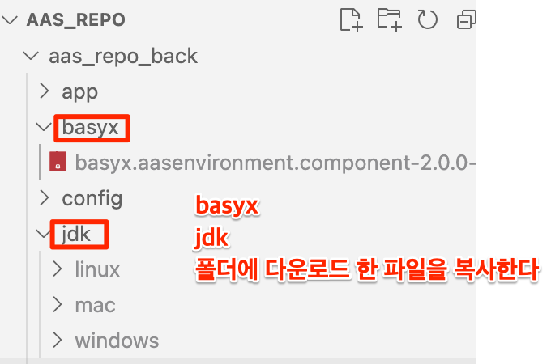

## 백엔드 프로젝트 구조

### 깃랩 또는 깃헙 동기화 후 추가 해야하는 작업 (파일 용량이 커서 별도 저장소에서 다운로드)
https://drive.google.com/file/d/1TttLeVi9bJ20oj_1sC9wuRiw3bSVD6uU/view?usp=sharing


```
AAS_REPO_BACK
│  aasrepo.service      ## 우분투 서비스 파일 만들기		
│  main.py              ## main.py 실행	
│  main_nginx.py        ## main_nginx.py nginx를 두어 서비스 다중 실행 할때
│  README.md
│  requirements.txt     ## pip install 목록
│
├─.vscode
│      launch.json      ## VSCODE 디버깅 옵션
│
├─app
│      aasInstanceModule.py     ## 인스턴스 모듈
│      aasModelModule.py        ## AAS모델 모듈
│      aasSubModelModule.py     ## AAS SUB모델 모듈
│      authModule.py			## 인증 모듈
│      basyxAasenvironmentModule.py		## 바식스 모듈
│      etcModule.py             ## 기타 시스템 모듈
│      publishModule.py         ## 배포 모듈
│
├─basyx
│      basyx.aasenvironment.component-2.0.0-SNAPSHOT-shaded.jar		## 바식스 Jar 파일
│
├─config															
│      config.py        ## 설정 파일 연결
│      config.yaml      ## 개발 서버 설정 파일
│      config_keti.yaml     ## 운영 서버 설정 파일
│
├─jdk       ## JVM호출을 위한 OPENJDK 서버 배포환경에 따른 참조
│  ├─linux
│      └─openjdk-17.0.2			## openjdk 리눅스 버전 17.0.2
│  └─windows
│      └─openjdk-17.0.2			## openjdk 윈도우 버전 17.0.2
│      
├─middleware														
│      authMiddleware.py        ## API Header 인증 모듈
│
├─processor
│      postgresProcess.py       ## DB 처리 모듈
│
├─router                ## 라우터 	
│      aasBasyx.py      ## 바식스 라우터
│      aasInstance.py   ## 인스턴스 라우터
│      aasmodel.py      ## AASMODEL 라우터		
│      aassubmodel.py   ## SUBMODEL 라우터
│      auth.py          ## 인증 라우터
│      etc.py           ## 기타 설정 라우터
│      publish.py       ## 배포 라우터
│
└─tools     ## 툴
        asyncTool.py        ## 비동기 처리 툴
        cryptoTool.py       ## 암호화 처리 툴
        jdbcTool.py         ## JVM 처리 툴
        loggerTool.py       ## 로그 처리 툴		
        stringTool.py       ## 문자열 처리 툴
```

## 기술 스택
```
  - python version : 3.13.1 
  - requirements.txt
    : pip install -r requrements.txt
  - java : openjdk 17.0.2  
    : python 에서 jdk-jvm 으로 호출 사용 
  - Baysix 
```

## VSCODE 디버그 모드
```
  - vscode debug mod  "launch.json" file

{
    // IntelliSense를 사용하여 가능한 특성에 대해 알아보세요.
    // 기존 특성에 대한 설명을 보려면 가리킵니다.
    // 자세한 내용을 보려면 https://go.microsoft.com/fwlink/?linkid=830387을(를) 방문하세요.
    "version": "0.2.0",
    "configurations": [
        {
            "name": "Python 디버거: FastAPI",
            "type": "debugpy",
            "request": "launch",
            "module": "uvicorn",
            "args": [
                "main:app",
                "--host", "0.0.0.0",
                "--port", "8000",
                //"--reload"
            ],
            "jinja": true
        }
    ]
}
```

## 자동 환경 설정 (권장)

### Linux/macOS 환경
```bash
# 스크립트 실행 권한 부여 (최초 1회만)
chmod +x setup_environment.sh

# 자동 환경 설정 실행
./setup_environment.sh
```

### Windows 환경
```cmd
# Windows 명령 프롬프트에서 실행
setup_environment.bat

# 또는 더블클릭으로 실행
```

이 스크립트들은 운영체제를 자동으로 감지하여 다음을 수행합니다:
- **Ubuntu/Debian**: apt 패키지 매니저로 필요한 라이브러리 설치
- **CentOS/RHEL**: yum 패키지 매니저로 필요한 라이브러리 설치  
- **Fedora**: dnf 패키지 매니저로 필요한 라이브러리 설치
- **macOS**: Homebrew로 필요한 라이브러리 설치
- **Windows**: 시스템 라이브러리 확인 및 Python 환경 설정

## 수동 설치 방법

### Windows 환경
```
1. 자동 환경 설정 실행 (권장)
   : setup_environment.bat
   
   이 스크립트가 자동으로 다음을 설치합니다:
   - Chocolatey 패키지 매니저
   - Python 3.13.1
   - Visual C++ Redistributable
   - Visual C++ Build Tools
   - Git
   - PostgreSQL 클라이언트
   - Python 가상환경 및 패키지

2. 수동 설치 (자동 설치 실패 시)
   - Python 3.13.1: https://www.python.org/downloads/windows/
   - Visual C++ Redistributable: https://aka.ms/vs/17/release/vc_redist.x64.exe
   - Visual C++ Build Tools: https://visualstudio.microsoft.com/visual-cpp-build-tools/
   - Git: https://git-scm.com/download/win
   - PostgreSQL: https://www.postgresql.org/download/windows/

3. JDK 확인
   - 프로젝트의 jdk/windows/openjdk-17.0.2 폴더에 이미 JDK가 포함되어 있음
   - 별도 설치 불필요

4. 서비스 실행
   : uvicorn main:app --host 0.0.0.0 --port 8000

```

### Linux (Ubuntu) 환경
```
1. Python 3.13.1 설치
   : sudo apt update
   : sudo apt install python3.13 python3.13-venv python3.13-pip

2. JDK 확인
   : 프로젝트의 jdk/linux/openjdk-17.0.2 폴더에 이미 JDK가 포함되어 있음
   : 별도 설치 불필요

3. 가상환경 생성 및 활성화
   : python3.13 -m venv venv
   : source venv/bin/activate

4. 의존성 설치
   : pip install -r requirements.txt

```

### macOS 환경
```
1. Python 3.13.1 설치
   : brew install python@3.13
   또는 https://www.python.org/downloads/ 에서 다운로드

2. JDK 확인
   : 프로젝트의 jdk/mac/openjdk-17.0.2 폴더에 이미 JDK가 포함되어 있음
   : 별도 설치 불필요

3. 가상환경 생성 및 활성화
   : python3.13 -m venv venv
   : source venv/bin/activate

4. 의존성 설치
   : pip install -r requirements_mac.txt

```

## 서비스 실행 방법
```  
  - 단독 fastapi
    : uvicorn main:app --host 0.0.0.0 --port 8000 
  
  - Multi fastapi (port 는 시작 포트, workers는 운영되는 서비스 갯수)
    : 가상환경 python main_nginx.py --host 0.0.0.0 --port 8081 workers 2
```

## ETC_DOCUMENT
```
	AAS_REPOSITORY_postgresql16_20250520.sql		## AAS Repository postgresql16 db 백업파일(SQL형식)
    AAS_REPOSITORY_postgresql16_20250520.tar		## AAS Repository postgresql16 db 백업파일(TAR형식)
    AAS_REPOSITORY_postgresql_Schema_Info.txt		## AAS Repository 스키마 생성 및 초기화
    AAS_REPOSITORY_관리자_매뉴얼_v.1.0.pptx			## 관리자 매뉴얼
    AAS_REPOSITORY_사용자_매뉴얼_v.1.0.pptx			## 사용자 매뉴얼
	AAS_REPOSITORY_구축_사업_개발환경.hwp			## 개발 환경 정보(Basyx 추가 사항 포함)
    AasEnvironmentApiHTTPController.java			## 바식스 수정 파일1
	DefaultAASEnvironment.java						## 바식스 수정 파일2
	https://download.java.net/java/GA/jdk17.0.2/dfd4a8d0985749f896bed50d7138ee7f/8/GPL/openjdk-17.0.2_windows-x64_bin.zip  		
		## openjdk windows version : 17.0.2 하위 폴더를 bin~부터 압축 풀어 jdk\windows\openjdk-17.0.2   압축 풀기
	https://download.java.net/java/GA/jdk17.0.2/dfd4a8d0985749f896bed50d7138ee7f/8/GPL/openjdk-17.0.2_linux-x64_bin.tar.gz
		## openjdk linux version : 17.0.2 하위 폴더를 bin~부터 압축 풀어 jdk\linux\openjdk-17.0.2   압축 풀기
```
